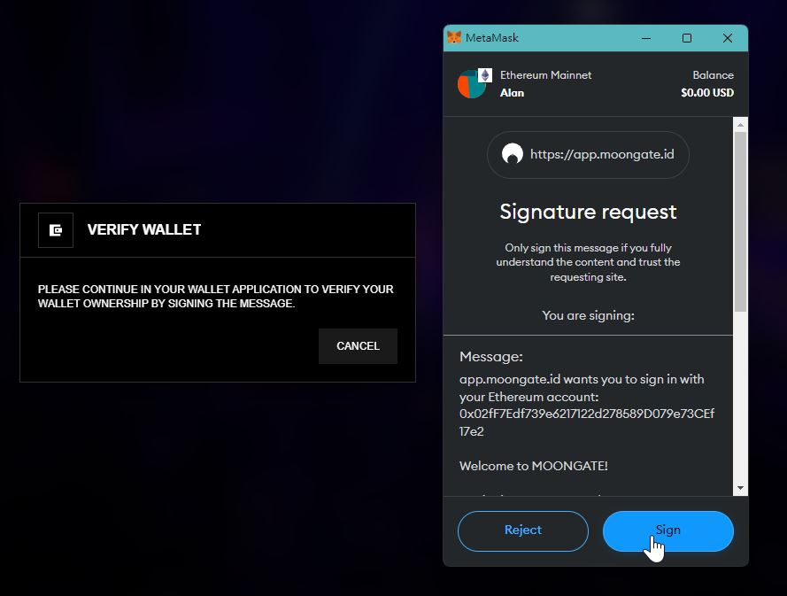

# Overview

Develop a custom Crypto-Wallet Connect Button Component to integrate with the MetaMask Chrome Extension using Next.js (version 12.3.4), TypeScript, [RainbowKit](https://www.rainbowkit.com/docs/custom-connect-button) and [SIWE](https://www.npmjs.com/package/siwe). This component should encapsulate all necessary wallet authentication steps, including wallet connection, message signing, signature verification, and error handling. The challenge aims to assess your ability to create dynamic, reusable, scalable, and extensible UI components.

## Objectives

While the default ConnectButton provided by RainbowKit offers basic connection functionality, your task is to create a Custom ConnectButton that enhances wallet authentication processes, including user confirmation, message signing, signature verification, and comprehensive error handling.

### 1. Crypto-Wallet Connect Button Component

- Utilize [RainbowKit](https://www.rainbowkit.com/docs/custom-connect-button) and [SIWE](https://www.npmjs.com/package/siwe) for the implementation.
- Serve as an abstract wrapper that provides all necessary wallet authentication functionalities but allows for custom children to define the button's UI.
- Implement the required authentication steps (Note: The UIs below are for illustration purposes only and do not require implementation):

  1. User clicks on Crypto-Wallet Connect Button.

  

  2. Open `RainbowKit Modal` to connect via `MetaMask`.

  

  3. User connects the wallet within the `MetaMask Chrome Extension`.

  

  4. After a successful connection, prompt the user to confirm the connecting wallet address.

  

  5. Prompt the user to sign a custom message within `MetaMask Chrome Extension`.

  

  6. Verify the signature post-signature. If valid, display the connected wallet address.

### 4. **Bonus:** UI/UX Design

- Ensure that the webpage is responsive and adapt to different screen sizes, especially mobile devices.
- Use SCSS or a UI framework / library of your choice for styling.

### 5. **Bonus:** Verify Wallet Signature from API

- Develop a mock API endpoint within the Next.js project for wallet signature verification.
- Modify `src/pages/index.tsx` to validate the wallet signature through this API.

## Requirements

- TypeScript and ES6+ code.
- Emphasis on maintainability and understandable code structure.
- Flexibility to modify the provided starter code.
- Option to use additional libraries to complete the task.

## Evaluation Criteria

- Functionality: The component must be fully functional, satisfying all stated objectives and requirements.
- Reusability and Scalability: Design components with reusability, extensibility, and scalability in mind.
- Responsiveness: The webpage should be responsive and mobile-friendly.
- Code Quality: Code should be clean, well-organized, and follow best practices.
- UI Design (Plus, not primary): A user-friendly and aesthetically pleasing UI is a plus, but the primary focus is on functionality and code quality.
- API Interaction (Bonus): Demonstrated ability to interact with APIs for enhanced functionality will be regarded as a bonus.
